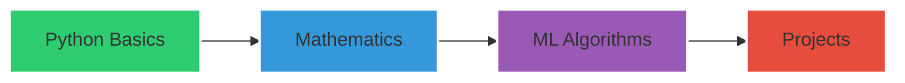
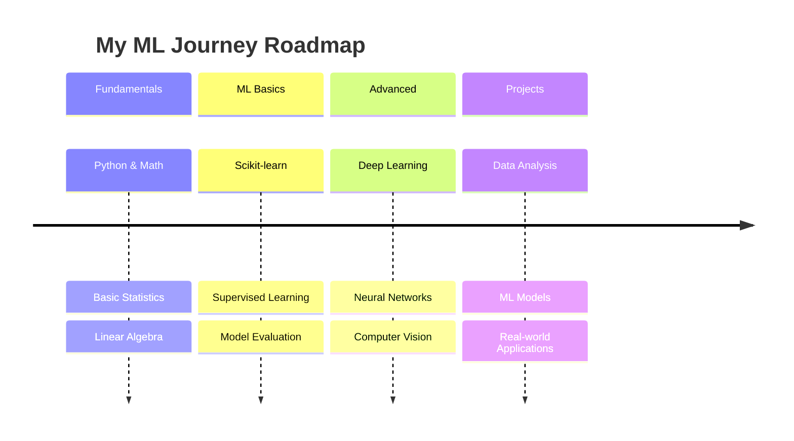

# Hi, I'm Samarajit Mane 👋 

<div align="center">
  
  
  
  [](https://git.io/typing-svg)
  
  [](https://github.com/notsamarajit)
  [](https://www.linkedin.com/in/samarajit01/)
  [](https://g.dev/samarajit)

</div>

## 🚀 About Me

I'm a passionate learner diving into the world of Machine Learning and AI. While I'm at the beginning of my journey, I'm committed to building a strong foundation in both theoretical and practical aspects of ML.


### 🎯 Current Focus
- 📊 Strengthening my mathematical foundation for ML (Statistics, Linear Algebra, Calculus)
- 🐍 Developing Python programming skills
- 🤖 Understanding core ML concepts and algorithms
- ☁️ Exploring cloud technologies (Google Cloud Platform certified)

### 🛠️ Skills & Tools

<div align="center">

| Category | Skills |
|----------|--------|
| **Programming Languages** |  |
| **Cloud & Tools** |   |
| **Development Environment** |   |
| **ML/Data Science Libraries** |    |
| **Mathematics** |   |
| **Version Control** |  |

</div>

### 📊 My GitHub Stats

<div align="center">
  
  
</div>

### 🎓 Certifications
<div align="center">
  
  
  
</div>

### 📚 Learning Journey

<div align="center">
  
</div>

I believe in learning in public and documenting my journey. Check out my [learning resources](/learning-resources) where I maintain notes and insights from my studies.

### 🌱 Current Learning Path

<div align="center">
  


</div>

### 🤝 Let's Connect

<div align="center">
  
[](your-linkedin-url)
[](your-github-url)
[](mailto:iammomstealer@gmail.com)

</div>

> "Every expert was once a beginner. This is my beginning." 

<div align="center">
  
  
  <!-- ### � Contribution Graph
  
  
   -->
  ### ⚡ Streak Stats
  
  [](https://git.io/streak-stats)
  
</div>

### 🎯 Future Goals & Roadmap

<div align="center">
  
  


### 🌟 Areas of Interest

<table align="center">
  <tr>
    <td align="center">
      
      <br>Machine Learning
    </td>
    <td align="center">
      
      <br>Deep Learning
    </td>
    <td align="center">
      
      <br>Data Science
    </td>
    <td align="center">
      
      <br>Cloud Computing
    </td>
  </tr>
</table>

### 📈 Weekly Development Breakdown

<div align="center">

```text
Mathematics     🧮 4 hrs 30 mins   ███████░░░░   35.5%
Python          🐍 3 hrs 45 mins   ██████░░░░░   29.8%
ML Theory       🤖 2 hrs 15 mins   ████░░░░░░░   17.9%
Projects        🚀 2 hrs 00 mins   ███░░░░░░░░   16.8%
```

</div>

### 🎮 Fun Facts

<table align="center">
  <tr>
    <td>
      
    </td>
    <td>
      
    </td>
  </tr>
  <tr>
    <td>
      
    </td>
    <td>
      
    </td>
  </tr>
</table>

---
<div align="center">
  
  
  <i>🚀 This portfolio is actively growing as I continue my learning journey in Machine Learning and AI.</i>
  
  
  
  <sub>Last updated: September 2025</sub>
</div>

