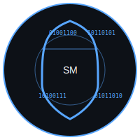
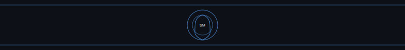

  

  <h1> SAMARAJIT MANE </h1>
  <h3>Cybersecurity Professional | SOC | DFIR </h3>
  

## 👨‍💻 About Me

Cybersecurity enthusiast with a passion for digital forensics, threat hunting, and secure system design. Committed to continuous learning and staying ahead of emerging threats in the ever-evolving cybersecurity landscape.

## 🔗 Connect With Me

  
  
  
  

## 🏆 Certifications & Badges

  
  
  

## 🛡️ Defending Profile

 
    
  </a>

## 🔧 Languages & Tools

### Programming Languages

  
  
  
  
  

### Operating Systems

  
  
  
  

### Security Tools & Frameworks

  
  
  
  
  
  
  
  
  
  
  
  
  

### Malware Analysis Tools

  
  
  
  
  
  

## 🚀 Projects

  

### 🔍 Network Traffic Analysis Tool
A Python-based tool for analyzing network traffic patterns and detecting anomalies using machine learning algorithms.

### 🛡️ Secure File Encryption System
A robust file encryption system implementing AES-256 encryption with secure key management.

### 🕵️ Digital Forensics Toolkit
A comprehensive toolkit for digital forensics investigations, including memory analysis and disk imaging tools.

### 🔐 Web Application Vulnerability Scanner
An automated scanner for detecting common web application vulnerabilities like SQL injection, XSS, and CSRF.

### 💻 Cybersecurity Learning Resources
A curated collection of cybersecurity learning resources, labs, and practice environments for beginners and advanced practitioners.

### 🧪 Malware Analysis Environment
A secure, isolated environment for analyzing malicious software and understanding attack vectors.

---

  

<!-- Note: The snake animation will work after the GitHub Action runs. The workflow file has been created in .github/workflows/snake.yml -->

---

  <h3>🔒 "The only truly secure system is one that is powered off, cast in a block of concrete and sealed in a lead-lined room with armed guards." 🔒</h3>

  

